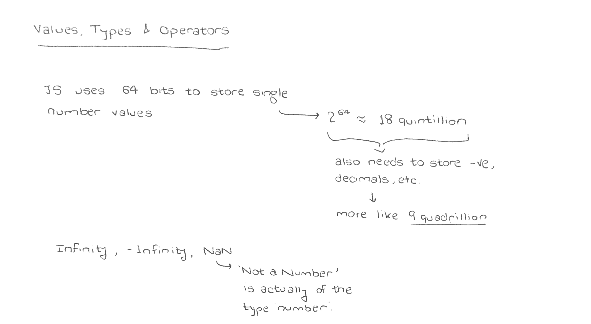

## Numbers

Javascript uses 64 bits to store a single number value. It basically means
2<sup>64</sup> total numerical values which comes around to about 18
quintillion. Since we also need to store negative values (essentially a bit to
hold the sign)and decimal numbers (essentially the position of the decimal
point), the numbers we can actually store comes out to be about 9
quadrillion. Arithmetic operations up to that range are guaranteed to be
precise.

## Special Numbers

There are a few special numbers in JS - `Infinity`, `-Infinity` and `NaN`.
`typeof NaN` is actually `"number"` even though it literally stands for
"Not a Number".

A few interesting operations on these are :

-   `Infinity * Infinity` = `Infinity`
-   `Infinity / 0` = `Infinity` (No idea why or how)
-   `Infinity / Infinity` = `NaN`
-   `Infinity + Infinity` = `Infinity`
-   `Infinity - Infinity` = `NaN`

## Strings

Javascript models strings based on the unicode standard using 16 bits per
string element. Essentially, JS can encode 2<sup>16</sup> kinds of characters
but apparently unicode has more than this so workaround here is emojis taking
up to character positions.

String literals need to be encoded in backticks.

## Booleans

There is only one value in Javascript that is not equal to itself. `NaN`.
Because, `NaN` is the result of a nonsensical operation so a nonsensical
operation cannot be equal to another nonsensical operation. Makes sense?

Also, worth noting :

```js
console.log(true ? 1 : 2); // → 1
console.log(false ? 1 : 2); // → 2
```

## Empty Values

`null` and `undefined` are values meant to represent an absence of a meaningful
value. For most use cases, these are interchangeable but they have subtle
differences.

-   `null` is an assigned value which means _nothing_.
-   `undefined` is generally the value of a declared variable that has not been
    set.
-   `null` and `undefined` are both false values along with `false`, `0`, `""`
    (empty string) and `NaN`.
-   `null` and `undefined` are both primitive values along with `Boolean`,
    `Number`, `String` and `Symbol`, however `typeof null` is `object`.
-   `null !== undefined` but `null == undefined`.

Lot of this can be attributed to a mistake in the original implementation of
Javascript. This might be worth looking into for further understanding :
[The Abstract Equality Comparison Algorithm](http://www.ecma-international.org/ecma-262/5.1/#sec-11.9.3)

## Automatic Type Conversion

Javascript tries to be smart and in an attempt to accept absurd things thrown at
it, it does something called `type coercion`.
Worth looking into [this](https://www.freecodecamp.org/news/js-type-coercion-explained-27ba3d9a2839/)
for more details.


